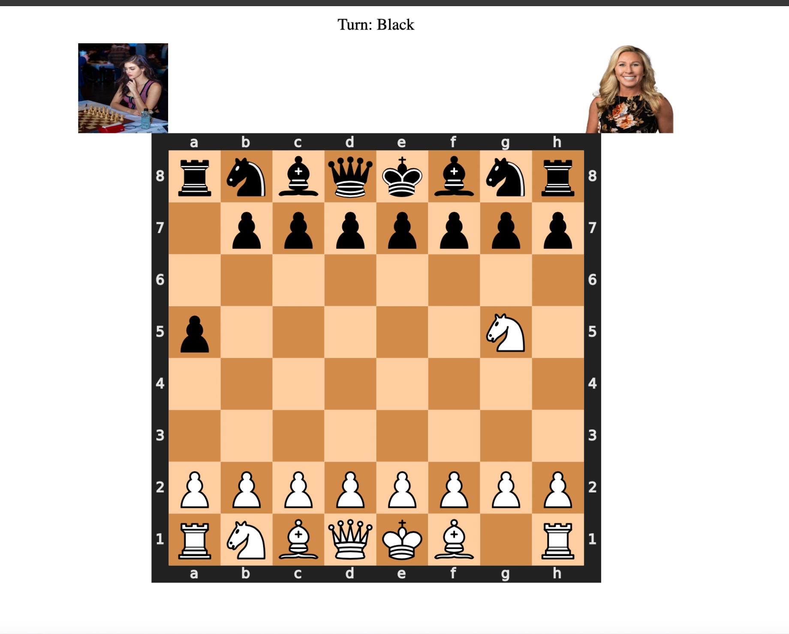

# Chess Bots Showdown

Welcome to Chess Bots Showdown, a simple chess game where two AI bots compete against each other to claim victory! This project was built for fun and serves as a demonstration of basic chess game mechanics and AI implementation.

## TODO

- [ ] **Integrate Neuroflow Library:** Implement bots using a neural network trained on the Neuroflow library.
- [ ] **Train Neural Network:** Create a training pipeline to train the neural network for chess gameplay.
- [ ] **Bot Configuration:** Add configuration options for the neural network-based bots in `config.py`.
- [ ] **Optimization:** Optimize the neural network-based bots for better efficiency and responsiveness.
- [ ] **User Interface:** Explore options to enhance the user interface, providing a more engaging experience.
- [ ] **Performance Metrics:** Implement performance metrics to evaluate the neural network-based bots' playing strength.
- [ ] **Documentation:** Update the README with instructions on configuring and using the neural network-based bots.


### Prerequisites

Make sure you have the following installed on your system:

- Python 3.12.1
- [Python Chess (python-chess)](https://python-chess.readthedocs.io/en/latest/)

You can install the required dependencies using:

```bash
pip install python-chess
pip install flask
```
### Preview
{: width="70%"}